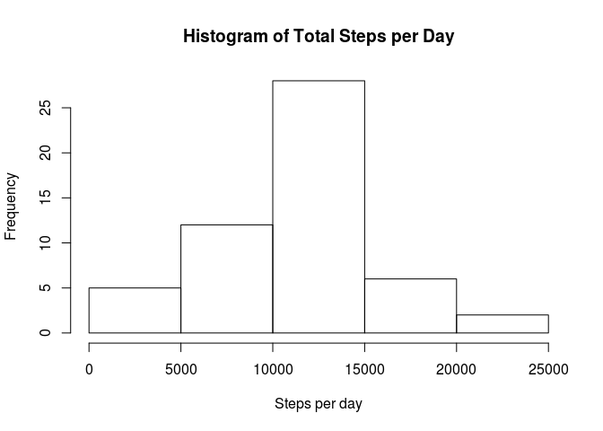
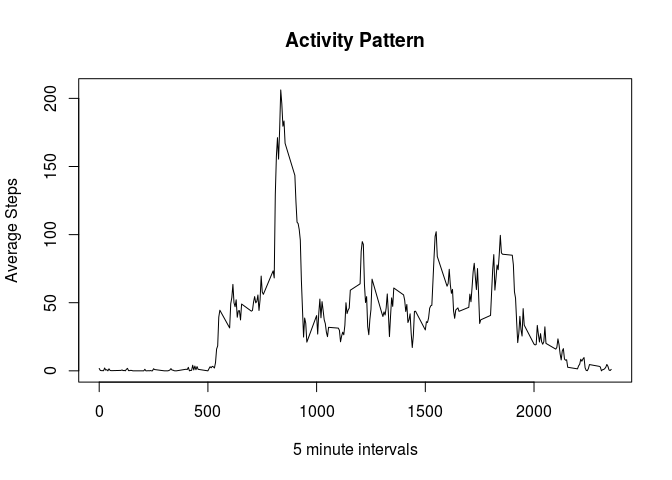
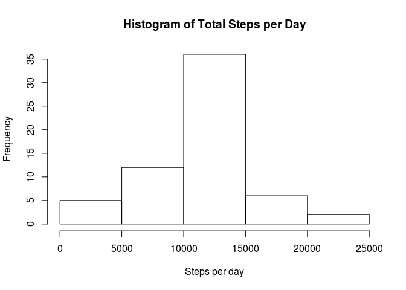
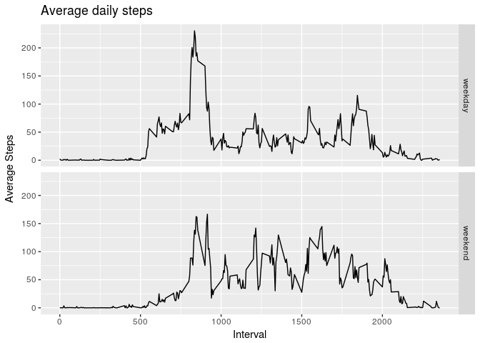

# Reproducible Research: Peer Assessment 1
kl  


## Loading and preprocessing the data


```r
if(!file.exists("activity.csv")){
        unzip(zipfile = "activity.zip")
}
MainDF <- read.csv(file = "activity.csv",
                   header = TRUE,
                   sep = ",",
                   na.strings = "NA",
                   stringsAsFactors = FALSE)
MainDF$date <- as.Date(MainDF$date,format = "%Y-%m-%d")
```


## What is mean total number of steps taken per day?

```r
MeanData <- aggregate(MainDF$steps~MainDF$date, FUN = sum)
hist(MeanData$`MainDF$steps`,
     xlab = "Steps per day",
     main = "Histogram of Total Steps per Day")
```

<!-- -->

```r
meanSteps <- mean(MeanData$`MainDF$steps`, na.rm = TRUE)
medianSteps <- median(MeanData$`MainDF$steps`, na.rm = TRUE)
```
The mean of total number of steps taken per day is 10766.1887.  
The median of total number of steps taken per day is 10765.

## What is the average daily activity pattern?

```r
PatternData <- aggregate(MainDF$steps~MainDF$interval, FUN = mean)
plot(x = PatternData$`MainDF$interval`,
     y = PatternData$`MainDF$steps`,
     type = "l",
     main = "Activity Pattern",
     xlab = "5 minute intervals",
     ylab = "Average Steps")
```

<!-- -->

```r
maxSteps <- PatternData$`MainDF$interval`[which.max(x = PatternData$`MainDF$steps`)]
```
The maximum number of steps on average is observed at interval 835.

## Imputing missing values

```r
SumNA <- sum(is.na(MainDF$steps))
```
There are 2304 missing values in the data set.

The mean values of the corresponding 5-minute intervals across the other days is used to impute the missing values.

```r
NewDF <- MainDF
for (i in PatternData$`MainDF$interval`){
        NewDF$steps[NewDF$interval==i] <- ifelse(is.na(MainDF$steps[MainDF$interval==i]),
                                                   PatternData$`MainDF$steps`[PatternData$`MainDF$interval`==i],
                                                   MainDF$steps[MainDF$interval==i])
} 

NewMeanData <- aggregate(NewDF$steps~NewDF$date, FUN = sum)
hist(NewMeanData$`NewDF$steps`,
     xlab = "Steps per day",
     main = "Histogram of Total Steps per Day")
```

<!-- -->

```r
NewMeanSteps <- mean(NewMeanData$`NewDF$steps`, na.rm = TRUE)
NewMedianSteps <- median(NewMeanData$`NewDF$steps`, na.rm = TRUE)
```
The new mean of total number of steps taken per day is 10766.1887.  
The new median of total number of steps taken per day is 10766.1887.  
The mean value has stayed the same, however, the median has increased due to more observations used.  


## Are there differences in activity patterns between weekdays and weekends?

```r
NewDF$dayType <- weekdays(NewDF$date)
NewDF$dayType <- ifelse(NewDF$dayType %in% c("Saturday", "Sunday"),"weekend","weekday")
NewDF$dayType <- factor(NewDF$dayType)
library(ggplot2)
Averages <- aggregate(NewDF$steps~NewDF$interval+NewDF$dayType, FUN = mean)
ggplot(Averages, aes(x=`NewDF$interval`, y=`NewDF$steps`)) +
        geom_line() + facet_grid(`NewDF$dayType` ~ .) +
        labs(x = "Interval", y = "Average Steps", title = "Average daily steps")
```

<!-- -->
